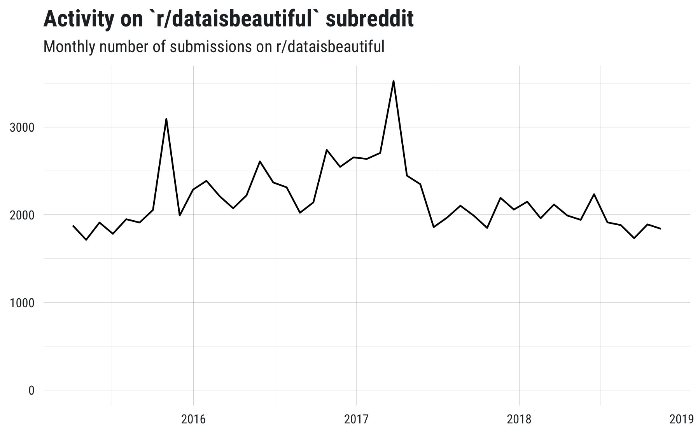

<!-- README.md is generated from README.Rmd. Please edit that file -->

# rreddit

[](https://travis-ci.org/mkearney/rreddit)
[](https://cran.r-project.org/package=rreddit)
[](https://codecov.io/gh/mkearney/rreddit?branch=master)

<!--#
#-->

[](https://www.tidyverse.org/lifecycle/#experimental)

> A package for getting lots of [Reddit](https://reddit.com) data.

## Installation

Install the development version from Github with:

``` r
## install remotes pkg if not already
if (!requireNamespace("remotes")) {
  install.packages("remotes")
}

## install from github
remotes::install_github("mkearney/rreddit")
```

## Use

An example of posts collected from the
[r/dataisbeautiful](https://reddit.com/r/dataisbeautiful) subreddit

``` r
## get up to 100,000 of the most recent posts made to /r/dataisbeautiful
d <- get_r_reddit("dataisbeautiful", n = 100000)

## aggregate by month and plot the time series
rtweet::ts_plot(dplyr::select(d, created_at = created_utc), "months", trim = 1) +
  tfse::theme_mwk(base_size = 12) +
  ggplot2::ylim(0, NA) +
  ggplot2::labs(
    x = NULL,
    y = NULL,
    title = "Activity on `r/dataisbeautiful` subreddit",
    subtitle = "Monthly number of submissions on r/dataisbeautiful"
  )
```

<p align="center">



</p>
